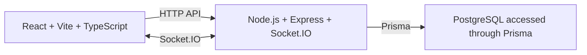

# Teco Architecture Overview

Teco is a V1 real-time, one-to-one chat application. The browser client calls the server through HTTP and receives live events through Socket.IO. The server applies all application rules and is the only component that accesses PostgreSQL through Prisma.



## Repository Layout

```text
Teco/
├── client/              # React application
├── server/              # Express and Socket.IO application
├── database/
│   └── prisma/          # Prisma schema, migrations, and seed data
├── docs/                # Project design documentation
├── docker-compose.yml   # Local PostgreSQL service
├── .env.example
└── README.md
```

## Responsibilities

| Area | Responsibility |
| --- | --- |
| `client/` | Interface, browser-side state, API calls, and real-time event handling. |
| `server/` | Authentication, authorization, validation, business rules, API endpoints, and Socket.IO events. |
| `database/prisma/` | Prisma schema, generated migrations, and development seed data. |
| PostgreSQL | Persistent storage for users, direct conversations, participants, and messages. |

## Detailed Design Documents

- [Frontend architecture](frontend.md)
- [Backend architecture](backend.md)
- [Database design](database.md)
- [Real-time Socket.IO design](socket.md)

## V1 Boundary

V1 includes registration and login, direct one-to-one conversations, persistent messages, and live message delivery. Each conversation has exactly two participants. Group chat is intentionally deferred to V2.

## V2: Group Chat

V2 can add a conversation type, group name and avatar, more than two participants, member-management actions, participant roles, and group-specific UI and authorization. These additions extend the same client → server → Prisma → PostgreSQL architecture.
