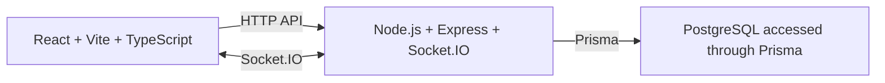

# Teco Architecture Overview

Teco is a V1 real-time, one-to-one chat application. The browser client calls the server through HTTP and receives live events through Socket.IO. The server applies all application rules and is the only component that accesses PostgreSQL through Prisma.



## Repository Layout

```text
Teco/
├── client/              # React application
├── server/              # Express application and Prisma schema
│   └── prisma/          # Current Prisma schema and migrations
├── docs/                # Project design documentation
├── docker-compose.yml   # Local PostgreSQL service
├── .env.example
├── README.md
└── .env                 # Local environment file
```

## Responsibilities

| Area | Responsibility |
| --- | --- |
| `client/` | Browser UI, local app state, and HTTP calls to the server. |
| `server/` | HTTP API, Prisma access, and future business rules. Auth and Socket.IO are not implemented yet. |
| `server/prisma/` | Prisma schema and migration files for the current database model. |
| PostgreSQL | Persistent storage for users, conversations, participants, and messages. |

## Detailed Design Documents

- [Frontend architecture](frontend.md)
- [Backend architecture](backend.md)
- [Database design](database.md)
- [Real-time Socket.IO design](socket.md)

## Current implementation status

The project is in a foundation stage. The server currently exposes a simple health endpoint, the client is still the default Vite starter UI, and the rest of the chat features are being designed and implemented incrementally.

## V1 Boundary

V1 includes registration and login, direct one-to-one conversations, persistent messages, and live message delivery. Each conversation has exactly two participants. Group chat is intentionally deferred to V2.

## V2: Group Chat

V2 can add a conversation type, group name and avatar, more than two participants, member-management actions, participant roles, and group-specific UI and authorization. These additions extend the same client → server → Prisma → PostgreSQL architecture.
