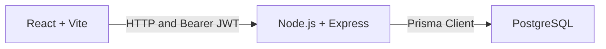

# Teco Architecture Overview

Teco currently has a React + Vite client, an Express API, JWT authentication, and PostgreSQL access through Prisma. Registration, login, session verification, and guarded client routes are implemented. Conversation workflows, message APIs, and Socket.IO delivery remain design work; the `/chat` screen is a placeholder.

## Current Request Path


```mermaid
flowchart LR
    Client["React + Vite"] -->|"HTTP and Bearer JWT"| Server["Node.js + Express"]
    Server -->|"Prisma Client"| Database["PostgreSQL"]
```

The browser does not connect directly to PostgreSQL. The server owns authentication, database access, and HTTP responses. Socket.IO is not currently part of the running application.

## Repository Layout

```text
Teco/
├── client/                 # React application and browser routes
├── server/                 # Express API and Prisma integration
│   ├── prisma/             # Schema, migrations, and seed script
│   └── src/                # Routes, controllers, services, middleware
├── docs/                   # Current behavior and proposed designs
├── docker-compose.yml      # Local PostgreSQL and Adminer
├── .env.example
└── README.md
```

## Responsibilities

| Area | Responsibility |
| --- | --- |
| `client/` | Registration and login UI, auth context, route guards, and HTTP API calls. |
| `server/` | Auth endpoints, JWT verification, user endpoints, and Prisma-backed database operations. |
| `server/prisma/` | Database schema, committed migrations, and a local seed script. |
| PostgreSQL | Persistent user, conversation, participant, and message records. |

## Implemented API

| Method | Route | Access |
| --- | --- | --- |
| `POST` | `/api/auth/register` | Public |
| `POST` | `/api/auth/login` | Public |
| `GET` | `/api/user/me` | JWT required |
| `GET` | `/api/user/details` | JWT required |
| `GET` | `/health` | Public |

All `/api/user` routes use JWT middleware. See [Authentication flow](authFlow.md) for request and response details.

## Design Documents

- [Frontend architecture](frontend.md)
- [Backend architecture](backend.md)
- [Database design](database.md)
- [New chat flow proposal](new-chat-flow.md)
- [Message lifecycle proposal](messageLifeCycle.md)
- [Socket.IO proposal](socket.md)

## V1 Boundary

The intended V1 is a one-to-one chat application with exactly two participants per conversation. The current database schema contains users, conversations, participants, and messages, but the server does not yet expose conversation or message endpoints and the client does not yet implement those workflows. Group chat remains a later extension.
## V2: Group Chat

V2 can add a conversation type, group name and avatar, more than two participants, member-management actions, participant roles, and group-specific UI and authorization. These additions extend the same client → server → Prisma → PostgreSQL architecture.
