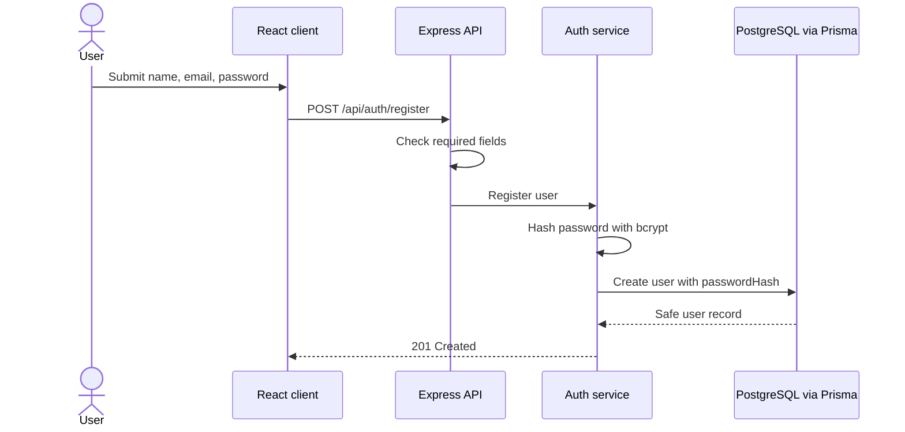
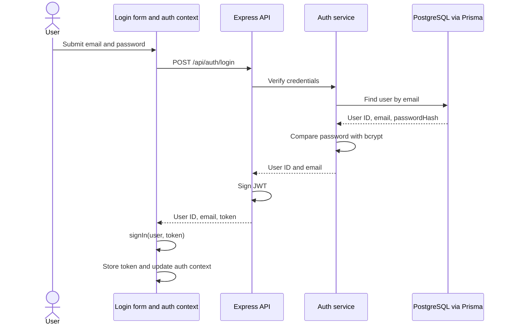
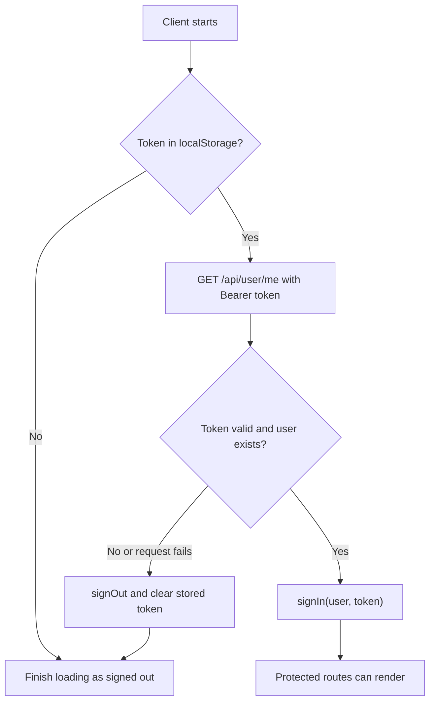

# Authentication Flow

JWT authentication is implemented for account registration, login, session restoration, and protected user API routes. Conversation and message authorization flows described elsewhere are not implemented yet.

## Registration

The client submits `name`, `email`, and `password` to `POST /api/auth/register`. `confirmPassword` is checked in the registration form and is not sent to the server. The server hashes the password with bcrypt before writing the user to PostgreSQL.



| Result | Response |
| --- | --- |
| Created | `201` with safe user details (`id`, `name`, `email`, `createdAt`) |
| Missing required field | `400` |
| Email already exists | `409` |
| Unexpected error | `500` |

## Login

The client submits `email` and `password` to `POST /api/auth/login`. The service looks up the account and compares the password with its bcrypt hash. A successful login returns a user object containing `id` and `email`, plus a signed JWT:

```json
{
  "user": { "id": "...", "email": "person@example.com" },
  "token": "..."
}
```

Invalid credentials return `401`. The client passes the response's `user` and `token` to the auth provider's `signIn` function. The provider updates in-memory state and stores the token in `localStorage`.



## Restoring a Session

At startup, the auth provider reads the stored token. If present, it requests `GET /api/user/me` with `Authorization: Bearer <token>`. The server returns the authenticated user's safe details. A valid response restores the context; a failed request clears the local session. While this check is pending, guarded routes show a loading state.



## Protected Routes and API Requests

The client protects `/chat` and redirects unauthenticated users to `/login`. The server independently protects every route mounted under `/api/user`; client route guards are only a navigation aid and do not grant API access.

The shared API client attaches the stored token to non-auth API routes. The server middleware returns `401` when a token is absent or expired and `403` when a supplied token is invalid. The current user routes are:

| Method | Route | Purpose |
| --- | --- | --- |
| `GET` | `/api/user/me` | Return the authenticated user's details |
| `GET` | `/api/user/details` | Return user details |

## Logout

The chat layout calls the provider's `signOut` function. It removes the token from `localStorage`, clears the user and token from context, and marks the session unauthenticated before navigating to `/login`.

## Token Configuration

The server requires a non-empty `JWT_SECRET` at startup. Tokens expire after one day by default; `JWT_EXPIRES_IN` can override the duration using a value accepted by `jsonwebtoken`. Keep the secret in a local environment file and never include it in client code.
