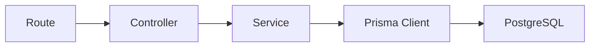
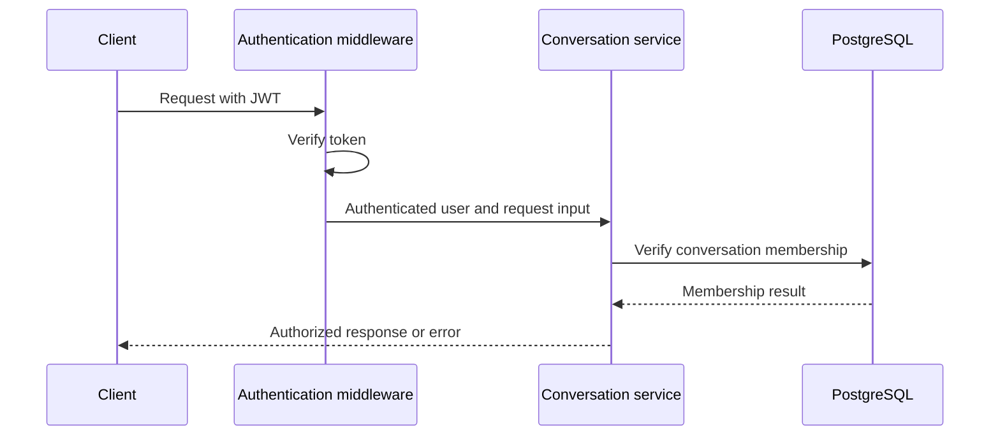

# Backend Architecture

## Purpose

`server/` contains the Node.js application. It exposes the HTTP API, authenticates and authorizes users, applies business rules, accesses PostgreSQL through Prisma, and hosts Socket.IO.

The Prisma source of truth lives in `server/prisma/schema.prisma`, and the committed migration history is in `server/prisma/migrations/`. The Prisma Client used at runtime is generated in `server/src/generated/prisma/` and imported through `server/src/lib/prisma.ts`.

## Technology

- Node.js
- Express
- TypeScript
- Prisma Client
- Socket.IO server

## Actual project structure

```text
server/
├── prisma/
│   ├── schema.prisma       # Prisma schema source of truth
│   ├── seed.ts            # Optional local seed script
│   └── migrations/        # Versioned database migrations
├── src/
│   ├── routes/            # URL and HTTP-method mappings
│   ├── controllers/       # Request and response handling
│   ├── services/          # Business rules and Prisma operations
│   ├── middleware/        # Auth, validation, and error handling
│   ├── sockets/           # Socket.IO setup and event handlers
│   ├── lib/
│   │   └── prisma.ts      # PrismaClient wrapper using DATABASE_URL
│   ├── generated/prisma/  # Generated Prisma Client output
│   ├── types/             # Server TypeScript types
│   ├── utils/             # Pure helper functions
│   ├── app.ts             # Express configuration
│   └── server.ts          # HTTP and Socket.IO startup
├── package.json
├── tsconfig.json
└── prisma.config.ts
```

## Request Flow



| Layer | Responsibility | Must not do |
| --- | --- | --- |
| Route | Maps an HTTP method and URL to a controller; attaches middleware. | Contain business logic. |
| Controller | Reads validated request input and writes the HTTP response. | Contain database queries or authorization rules. |
| Service | Checks data-dependent permissions and applies business rules. | Depend on Express request/response objects. |
| Prisma | Translates service operations to database queries. | Be called directly from the browser or client code. |

## Prisma responsibility boundaries

- `server/prisma/schema.prisma` defines the data model and relation rules.
- `server/prisma/migrations/` stores migration SQL for each schema change.
- `server/src/lib/prisma.ts` is the app-level Prisma entry point and reads `DATABASE_URL` from environment variables.
- `server/src/generated/prisma/` is generated output from the schema and is not manual application code.
- Services call Prisma for data access. Routes and controllers should not talk to the database directly.

## Initial HTTP API

| Group | Endpoint | Purpose |
| --- | --- | --- |
| Health | `GET /health` | Confirm the server is running. |
| Authentication | `POST /api/auth/register` | Create a user with a hashed password. |
| Authentication | `POST /api/auth/login` | Verify credentials and issue an access token. |
| Authentication | `GET /api/auth/me` | Return the current authenticated user. |
| Conversations | `GET /api/conversations` | List the user's direct conversations. |
| Conversations | `POST /api/conversations` | Create or return a direct conversation with one selected user. |
| Conversations | `GET /api/conversations/:id` | Read one direct conversation the user belongs to. |
| Messages | `GET /api/conversations/:id/messages` | Read paginated messages. |
| Messages | `POST /api/conversations/:id/messages` | Persist a message in an authorized conversation. |

## Authentication and Authorization



- Registration validates input, hashes the password, and stores only the hash.
- Login compares the submitted password to the stored hash.
- The JWT identifies the authenticated user; `JWT_SECRET` stays on the server.
- Protected endpoints verify the JWT before reaching a controller.
- Conversation and message services verify membership before reading or writing data.
- A request for a missing resource returns `404`; an existing resource a user cannot access returns the chosen safe authorization response consistently.

## Error Handling

Validation errors, authentication failures, authorization failures, missing resources, conflicts, and unexpected errors pass through one error-handling strategy. Controllers return predictable status codes and JSON error bodies; internal error details are logged but not exposed to the client.

## Environment Variables

| Variable | Purpose |
| --- | --- |
| `DATABASE_URL` | PostgreSQL connection string used by Prisma. |
| `JWT_SECRET` | Signs and verifies access tokens. |
| `PORT` | HTTP and Socket.IO server port. |
| `CLIENT_URL` | Allowed browser origin for CORS. |

## Local Prisma workflow

From the repo root, the reproducible steps are:

```bash
cp .env.example .env
docker compose up -d
cd server
npm install
npx prisma migrate deploy
npx prisma generate
```

After that, run the runtime check:

```bash
cd server
node --env-file ../.env --input-type=module <<'EOF'
import { PrismaPg } from '@prisma/adapter-pg'
import { PrismaClient } from './src/generated/prisma/client.js'

const adapter = new PrismaPg({ connectionString: process.env.DATABASE_URL })
const prisma = new PrismaClient({ adapter })
const result = await prisma.$queryRaw`SELECT 1 AS ok`
console.log(JSON.stringify(result))
await prisma.$disconnect()
EOF
```

## V1 Boundary and V2

V1 creates only direct conversations and requires exactly two participants. Group creation, membership mutation, roles, and group-specific authorization are V2 work. The service layer is the correct place to add those rules later.
