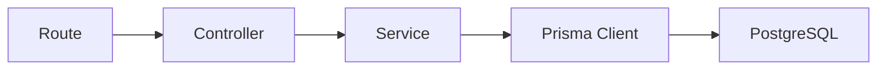
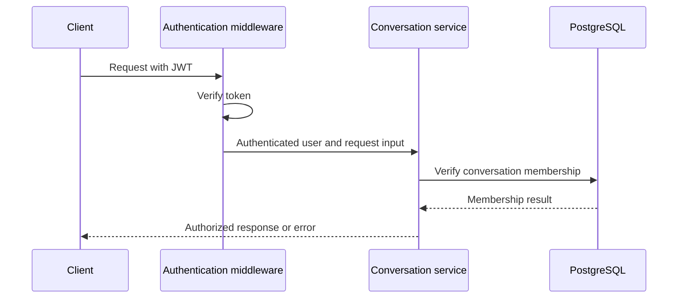

# Backend Architecture

## Purpose

`server/` contains the Node.js application. It exposes the HTTP API, authenticates and authorizes users, applies business rules, accesses PostgreSQL through Prisma, and hosts Socket.IO.

## Technology

- Node.js
- Express
- TypeScript
- Prisma Client
- Socket.IO server

## Planned Structure

```text
server/
├── src/
│   ├── routes/          # URL and HTTP-method mappings
│   ├── controllers/     # Request and response handling
│   ├── services/        # Business rules and Prisma operations
│   ├── middleware/      # Auth, validation, and error handling
│   ├── sockets/         # Socket.IO setup and event handlers
│   ├── lib/             # Shared integrations, including Prisma
│   ├── types/           # Server TypeScript types
│   ├── utils/           # Pure helper functions
│   ├── app.ts           # Express configuration
│   └── server.ts        # HTTP and Socket.IO startup
├── package.json
└── tsconfig.json
```

## Request Flow



| Layer | Responsibility | Must not do |
| --- | --- | --- |
| Route | Maps an HTTP method and URL to a controller; attaches middleware. | Contain business logic. |
| Controller | Reads validated request input and writes the HTTP response. | Contain database queries or authorization rules. |
| Service | Checks data-dependent permissions and applies business rules. | Depend on Express request/response objects. |
| Prisma | Translates service operations to database queries. | Be called by the client. |

## Initial HTTP API

| Group | Endpoint | Purpose |
| --- | --- | --- |
| Health | `GET /health` | Confirm the server is running. |
| Authentication | `POST /api/auth/register` | Create a user with a hashed password. |
| Authentication | `POST /api/auth/login` | Verify credentials and issue an access token. |
| Authentication | `GET /api/auth/me` | Return the current authenticated user. |
| Conversations | `GET /api/conversations` | List the user's direct conversations. |
| Conversations | `POST /api/conversations` | Create or return a direct conversation with one selected user. |
| Conversations | `GET /api/conversations/:id` | Read one direct conversation the user belongs to. |
| Messages | `GET /api/conversations/:id/messages` | Read paginated messages. |
| Messages | `POST /api/conversations/:id/messages` | Persist a message in an authorized conversation. |

## Conversation Creation Flow

See [new-chat-flow.md](./new-chat-flow.md) for the detailed transaction flow when creating a new direct conversation.

## Authentication and Authorization



- Registration validates input, hashes the password, and stores only the hash.
- Login compares the submitted password to the stored hash.
- The JWT identifies the authenticated user; `JWT_SECRET` stays on the server.
- Protected endpoints verify the JWT before reaching a controller.
- Conversation and message services verify membership before reading or writing data.
- A request for a missing resource returns `404`; an existing resource a user cannot access returns the chosen safe authorization response consistently.

## Error Handling

Validation errors, authentication failures, authorization failures, missing resources, conflicts, and unexpected errors pass through one error-handling strategy. Controllers return predictable status codes and JSON error bodies; internal error details are logged but not exposed to the client.

## Environment Variables

| Variable | Purpose |
| --- | --- |
| `DATABASE_URL` | PostgreSQL connection string used by Prisma. |
| `JWT_SECRET` | Signs and verifies access tokens. |
| `PORT` | HTTP and Socket.IO server port. |
| `CLIENT_URL` | Allowed browser origin for CORS. |

## V1 Boundary and V2

V1 creates only direct conversations and requires exactly two participants. Group creation, membership mutation, roles, and group-specific authorization are V2 work. The service layer is the correct place to add those rules later.
