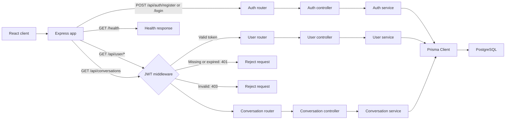

# Backend Architecture

The `server/` package is a Node.js and Express API. It implements registration, login, JWT middleware, protected user and conversation-list endpoints, and a health endpoint. It accesses PostgreSQL through Prisma. Message APIs and Socket.IO are not implemented.

## Technology

- Node.js and Express
- TypeScript
- Prisma Client with the PostgreSQL adapter
- bcrypt for password hashing
- jsonwebtoken for access tokens

## Current Structure

```text
server/
├── prisma/
│   ├── schema.prisma
│   ├── seed.ts
│   └── migrations/
└── src/
    ├── controllers/        # HTTP request/response handling
    ├── lib/                # JWT and Prisma clients
    ├── middleware/domain/  # Authentication and domain errors
    ├── routes/             # Auth, user, and conversation route registration
    ├── services/           # Auth, user, and conversation database operations
    ├── types/
    ├── app.ts              # Express middleware and routes
    └── server.ts           # Environment loading and HTTP startup
```

## Request Flow


```mermaid
flowchart LR
    Client["React client"] --> App["Express app"]
    App -->|"POST /api/auth/register or /login"| AuthRoute["Auth router"]
    AuthRoute --> AuthController["Auth controller"]
    AuthController --> AuthService["Auth service"]
    AuthService --> Prisma["Prisma Client"]
    App -->|"GET /api/user/*"| Middleware{"JWT middleware"}
    App -->|"GET /api/conversations"| Middleware
    Middleware -->|"Valid token"| UserRoute["User router"]
    Middleware -->|"Missing or expired: 401"| Unauthorized["Reject request"]
    Middleware -->|"Invalid: 403"| Forbidden["Reject request"]
    UserRoute --> UserController["User controller"]
    UserController --> UserService["User service"]
    UserService --> Prisma
    Middleware --> ConversationRoute["Conversation router"]
    ConversationRoute --> ConversationController["Conversation controller"]
    ConversationController --> ConversationService["Conversation service"]
    ConversationService --> Prisma
    App -->|"GET /health"| Health["Health response"]
    Prisma --> Database["PostgreSQL"]
```

Controllers translate HTTP inputs and results. Services contain the database operations. The browser never accesses Prisma or PostgreSQL directly.

## Implemented Routes

| Method | Endpoint | Access | Behavior |
| --- | --- | --- | --- |
| `GET` | `/health` | Public | Returns a simple server health response. |
| `POST` | `/api/auth/register` | Public | Hashes the password and creates a user. |
| `POST` | `/api/auth/login` | Public | Verifies credentials and returns user ID, email, and JWT. |
| `GET` | `/api/user/me` | JWT required | Returns the current user's safe profile. |
| `GET` | `/api/user/details` | JWT required | Returns safe details for all users. |
| `GET` | `/api/conversations` | JWT required | Lists conversations containing the authenticated user, counterpart names, and the latest message preview. Each conversation includes `id`, `createdAt`, and `updatedAt`. |

All `/api/user` and `/api/conversations` routes pass through `authenticateToken`. Missing or expired tokens receive `401`; invalid tokens receive `403`. The middleware attaches the verified token payload to `req.user`, which the conversation service uses to limit results to the signed-in user.

## Authentication and Errors

- Passwords are stored as bcrypt hashes, not plaintext.
- `JWT_SECRET` must be set and non-empty before the server starts.
- Access tokens contain `userId` and `email`; the default expiry is one day.
- Duplicate registration responds with `409`; unexpected registration errors respond with `500`.
- Invalid login credentials respond with `401`.

The current implementation uses direct controller error responses. A shared validation and error-handling layer is future cleanup; the broader error-handling approach described in the design backlog is not yet implemented.

## Environment and Local Startup

The server loads its environment from `server/.env` when run from the server package. Create the root environment from the example, set a private `JWT_SECRET`, and copy it into the server package:

```bash
cp .env.example .env
# Edit .env and replace JWT_SECRET with a private random value.
cp .env server/.env
docker compose up -d
cd server
npm ci
npx prisma migrate deploy
npx prisma generate
npm run dev
```

The app-level Prisma client reads `DATABASE_URL`. Prisma CLI settings and schema paths are defined in `server/prisma.config.ts`.

## Planned Server Work

The following architecture documents describe future behavior, not current endpoints or runtime services:

- [New chat flow](new-chat-flow.md)
- [Message lifecycle](messageLifeCycle.md)
- [Socket.IO design](socket.md)

Message creation, message history, and live delivery remain future work. Conversation reads must continue to enforce participant membership.
