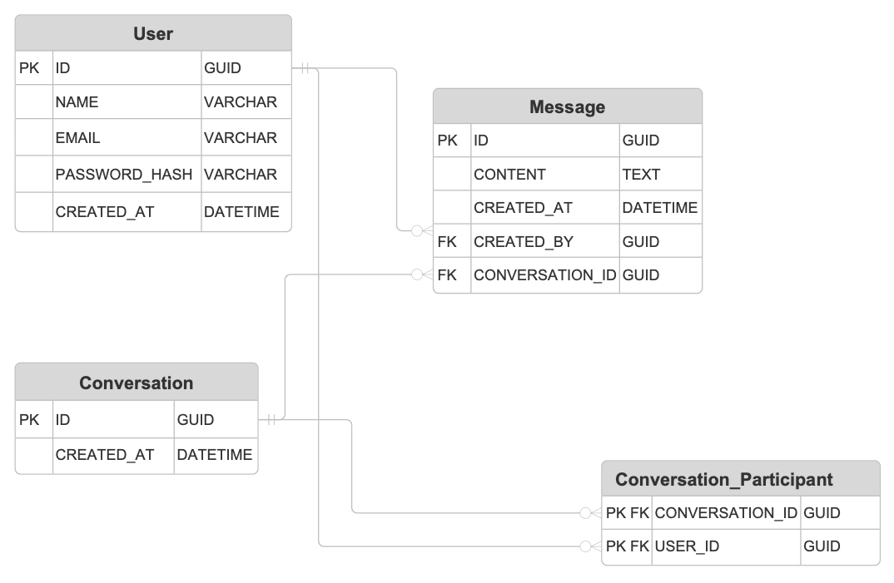
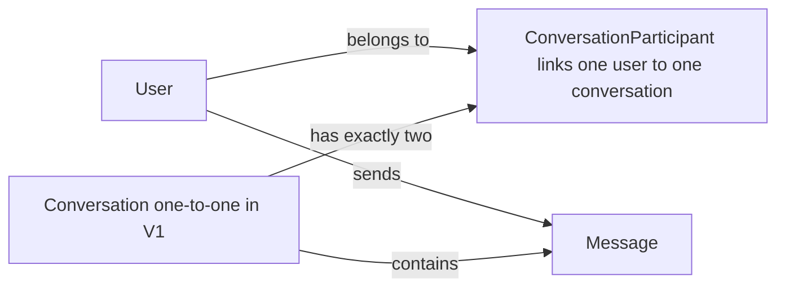
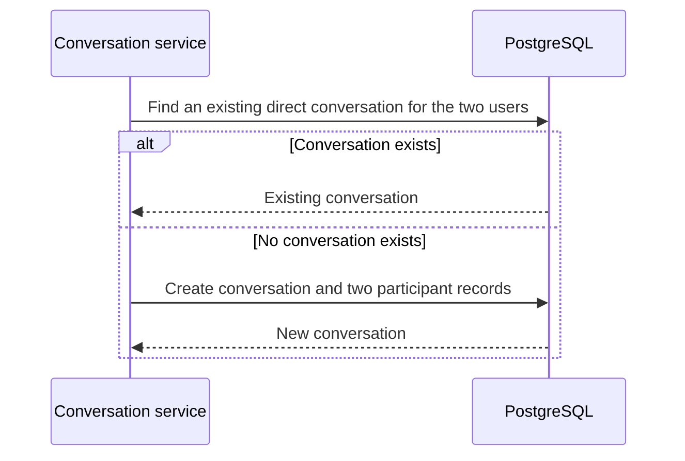

# Database Design

## Purpose

PostgreSQL is Teco's persistent store. Prisma owns the schema definition and migrations in `server/prisma/`; the server uses Prisma Client to access it. The browser client never connects to the database.

## Final Prisma paths in this repo

```text
server/
├── prisma/
│   ├── schema.prisma       # Canonical Prisma schema for the app
│   ├── seed.ts            # Local seed script (when added)
│   └── migrations/        # Committed migration files
└── src/
    └── generated/prisma/  # Generated Prisma Client, refreshed via `npx prisma generate`
```

The schema file and migration history are versioned and committed. The generated client is created locally from the schema and should be regenerated instead of manually edited.

## V1 Scope

V1 supports direct, one-to-one conversations only. Each conversation has exactly two `ConversationParticipant` records. Messages belong to one conversation and one sending user.

## Logical Data Model





## Design Reasoning

`ConversationParticipant` is the join record between users and conversations. A conversation therefore represents the chat itself, while its two participant records represent who is allowed to take part in it. This avoids assigning artificial `userId1` and `userId2` roles to the two people in a direct chat.

Each message stores its conversation and its sender, rather than a receiver ID. In a one-to-one conversation, the receiver is the other participant. Storing a receiver on every message would duplicate membership data and could allow an inconsistent message whose receiver is not part of the conversation.

The participant table also leaves a clear path to group chat later: a group conversation would add participant rows instead of requiring a different message structure. V1 still deliberately enforces exactly two participants per conversation.

## Tables

### User

| Column | Type | Rules | Purpose |
| --- | --- | --- | --- |
| `id` | UUID | Primary key | Identifies the user. |
| `name` | String | Required | Display name shown in the chat UI. |
| `email` | String | Required, unique | Used for login. |
| `passwordHash` | String | Required | Stores a password hash, never the original password. |
| `createdAt` | DateTime | Required | Creation timestamp. |
| `updatedAt` | DateTime | Required | Last-update timestamp. |

### Conversation

| Column | Type | Rules | Purpose |
| --- | --- | --- | --- |
| `id` | UUID | Primary key | Identifies a direct conversation. |
| `createdAt` | DateTime | Required | Creation timestamp. |
| `updatedAt` | DateTime | Required | Updated when a message changes conversation activity. |

### ConversationParticipant

| Column | Type | Rules | Purpose |
| --- | --- | --- | --- |
| `conversationId` | UUID | Foreign key to `Conversation` | Identifies the conversation. |
| `userId` | UUID | Foreign key to `User` | Identifies a participant. |
| `createdAt` | DateTime | Required | When the participant record was created. |

The combination of `conversationId` and `userId` is unique. This prevents the same user from being attached twice to one conversation.

### Message

| Column | Type | Rules | Purpose |
| --- | --- | --- | --- |
| `id` | UUID | Primary key | Identifies the message. |
| `conversationId` | UUID | Foreign key to `Conversation` | Identifies the message's conversation. |
| `senderId` | UUID | Foreign key to `User` | Identifies the sending user. |
| `content` | String | Required | The message body. |
| `createdAt` | DateTime | Required | Send timestamp. |
| `updatedAt` | DateTime | Required | Last-update timestamp. |

## Relationship Rules



- A user may be in many direct conversations.
- A V1 conversation must have exactly two distinct users.
- The service prevents duplicate direct conversations for the same pair of users.
- A message sender must be a participant in the message's conversation.
- Foreign keys prevent messages and participant records from pointing to missing users or conversations.

## Indexes and Constraints

| Table | Index or constraint | Reason |
| --- | --- | --- |
| `User` | Unique `email` | Prevent duplicate accounts and enable login lookup. |
| `ConversationParticipant` | Unique `(conversationId, userId)` | Prevent duplicate membership. |
| `ConversationParticipant` | Index `userId` | Efficiently list a user's conversations. |
| `Message` | Index `(conversationId, createdAt)` | Efficiently load a conversation's messages in time order. |

## Current Prisma schema

The actual Prisma schema lives at `server/prisma/schema.prisma` and is the source of truth for the database. The generated client output in `server/src/generated/prisma` is produced automatically and should not be hand-edited.

```prisma
model User {
  id                       String                     @id @default(uuid())
  email                    String                     @unique
  name                     String
  passwordHash             String
  createdAt                DateTime                   @default(now())
  messages                 Message[]
  conversationParticipants Conversation_Participant[]
}

model Message {
  id             String       @id @default(uuid())
  content        String
  createdAt      DateTime     @default(now())
  createdBy      User         @relation(fields: [createdById], references: [id])
  createdById    String
  conversation   Conversation @relation(fields: [conversationId], references: [id])
  conversationId String

  @@index([conversationId, createdAt])
}

model Conversation {
  id                       String                     @id @default(uuid())
  createdAt                DateTime                   @default(now())
  messages                 Message[]
  conversationParticipants Conversation_Participant[]
}

model Conversation_Participant {
  conversationId String
  userId         String

  conversation Conversation @relation(fields: [conversationId], references: [id])
  user         User         @relation(fields: [userId], references: [id])

  @@id([conversationId, userId])
  @@index([userId])
}
```

## Prisma workflow

Use the repo-local workflow in this order:

```bash
cp .env.example .env
cd server
npm install
npx prisma migrate deploy
npx prisma generate
node --env-file ../.env --input-type=module <<'EOF'
import { PrismaPg } from '@prisma/adapter-pg'
import { PrismaClient } from './src/generated/prisma/client.js'

const adapter = new PrismaPg({ connectionString: process.env.DATABASE_URL })
const prisma = new PrismaClient({ adapter })
const result = await prisma.$queryRaw`SELECT 1 AS ok`
console.log(JSON.stringify(result))
await prisma.$disconnect()
EOF
```

Each schema change is captured as a migration in `server/prisma/migrations/`. Apply migrations with `npx prisma migrate deploy` for a fresh local setup or `npx prisma migrate dev` during active schema work.

## Committed vs local artifacts

Committed in Git:
- `server/prisma/schema.prisma`
- `server/prisma/migrations/**`
- `server/prisma/seed.ts` if it exists

Local-only and not committed:
- `.env` and `.env.*`
- Docker-managed database storage in the `postgres-data` volume
- any generated Prisma Client output in `server/src/generated/prisma/`

## V2: Group Chat

Group chat can add a conversation type, group name and avatar, participant roles, and membership-management actions. At that stage the application relaxes V1's exactly-two-participant rule and adds authorization rules for group roles. No V2 fields are added prematurely to V1.
