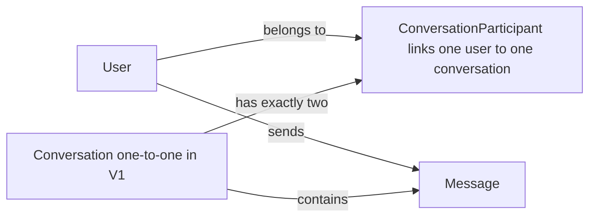
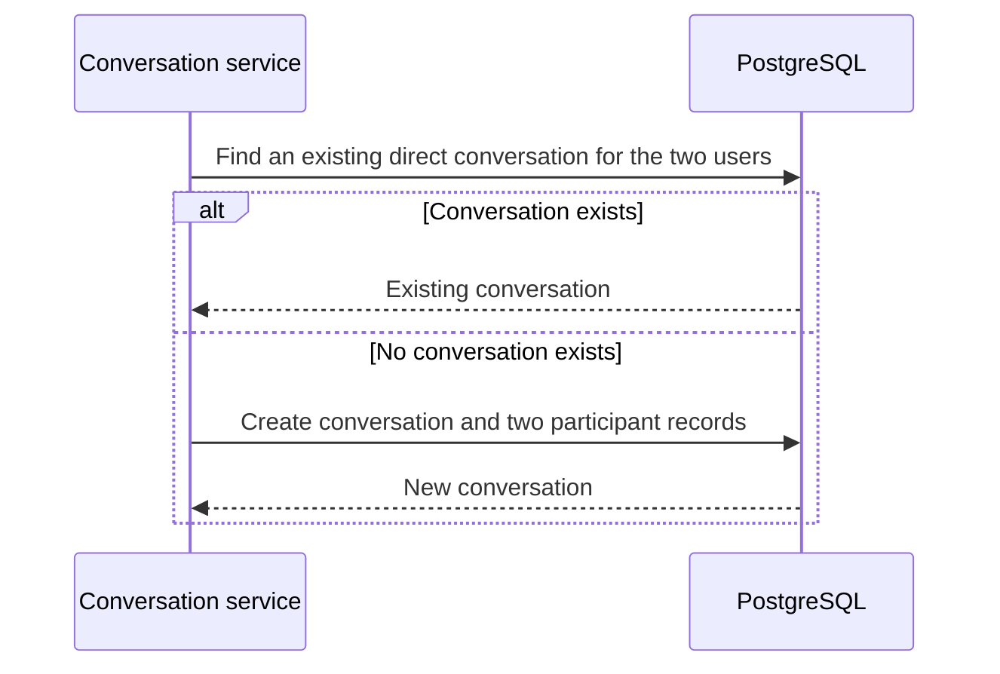

# Database Design

## Current implementation

The actual Prisma schema for this repo lives in `server/prisma/schema.prisma`. The current implementation defines the models `User`, `Conversation`, `Conversation_Participant`, and `Message` in that file. PostgreSQL is still configured via Docker Compose, and the browser client does not connect directly to the database.

## Purpose

PostgreSQL is Teco's persistent store. Prisma owns the schema definition and migrations in `server/prisma/`; the server uses Prisma Client to access it. The browser client never connects to the database.

## V1 Scope

V1 supports direct, one-to-one conversations only. Each conversation has exactly two `ConversationParticipant` records. Messages belong to one conversation and one sending user.

## Logical Data Model




## Design Reasoning

`ConversationParticipant` is the join record between users and conversations. A conversation therefore represents the chat itself, while its two participant records represent who is allowed to take part in it. This avoids assigning artificial `userId1` and `userId2` roles to the two people in a direct chat.

Each message stores its conversation and its sender, rather than a receiver ID. In a one-to-one conversation, the receiver is the other participant. Storing a receiver on every message would duplicate membership data and could allow an inconsistent message whose receiver is not part of the conversation.

The participant table also leaves a clear path to group chat later: a group conversation would add participant rows instead of requiring a different message structure. V1 still deliberately enforces exactly two participants per conversation.

## Tables

### User

| Column | Type | Rules | Purpose |
| --- | --- | --- | --- |
| `id` | `String` | Primary key, generated as UUID | Identifies the user. |
| `email` | `String` | Required, unique | Login credential and account key. |
| `name` | `String` | Required | Display name shown in the app. |
| `passwordHash` | `String` | Required | Stores the hashed password, never the raw password. |
| `createdAt` | `DateTime` | Required | Creation timestamp. |
| `messages` | `Message[]` | Relation | Messages sent by the user. |
| `conversationParticipants` | `Conversation_Participant[]` | Relation | Conversations the user belongs to. |

### Conversation

| Column | Type | Rules | Purpose |
| --- | --- | --- | --- |
| `id` | `String` | Primary key, generated as UUID | Identifies a conversation. |
| `createdAt` | `DateTime` | Required | Creation timestamp. |
| `messages` | `Message[]` | Relation | Messages in the conversation. |
| `conversationParticipants` | `Conversation_Participant[]` | Relation | Users attached to the conversation. |

### Conversation_Participant

| Column | Type | Rules | Purpose |
| --- | --- | --- | --- |
| `conversationId` | `String` | Composite primary key / FK to `Conversation` | Identifies the conversation. |
| `userId` | `String` | Composite primary key / FK to `User` | Identifies a participant. |
| `conversation` | `Conversation` | Required relation | Conversation record. |
| `user` | `User` | Required relation | Participant user record. |

The combination of `conversationId` and `userId` is unique by design. This prevents the same user from being attached twice to one conversation.

### Message

| Column | Type | Rules | Purpose |
| --- | --- | --- | --- |
| `id` | `String` | Primary key, generated as UUID | Identifies the message. |
| `content` | `String` | Required | The message body. |
| `createdAt` | `DateTime` | Required | Send timestamp. |
| `createdBy` | `User` | Required relation | User who sent the message. |
| `createdById` | `String` | Required FK to `User` | Sender reference. |
| `conversation` | `Conversation` | Required relation | Parent conversation. |
| `conversationId` | `String` | Required FK to `Conversation` | Conversation reference. |

The current implementation uses the actual Prisma field names in `server/prisma/schema.prisma`, including `createdById` instead of `senderId` and `Conversation_Participant` instead of `ConversationParticipant`.

## Relationship Rules



- A user may be in many direct conversations.
- A V1 conversation must have exactly two distinct users.
- The service prevents duplicate direct conversations for the same pair of users.
- A message sender must be a participant in the message's conversation.
- Foreign keys prevent messages and participant records from pointing to missing users or conversations.

## Indexes and Constraints

| Table | Index or constraint | Reason |
| --- | --- | --- |
| `User` | Unique `email` | Prevent duplicate accounts and enable login lookup. |
| `Conversation_Participant` | Composite primary key `(conversationId, userId)` | Prevent duplicate membership. |
| `Conversation_Participant` | Index `userId` | Efficiently list a user's conversations. |
| `Message` | Index `(conversationId, createdAt)` | Efficiently load a conversation's messages in time order. |

## Planned Prisma Schema

This is the intended V1 shape. It is a design reference; the actual `schema.prisma` will be created during the Prisma setup issue.

```prisma
model User {
  id            String                    @id @default(uuid())
  name          String
  email         String                    @unique
  passwordHash  String
  createdAt     DateTime                  @default(now())
  updatedAt     DateTime                  @updatedAt
  participants  ConversationParticipant[]
  sentMessages  Message[]                 @relation("SentMessages")
}

model Conversation {
  id            String                    @id @default(uuid())
  createdAt     DateTime                  @default(now())
  updatedAt     DateTime                  @updatedAt
  participants  ConversationParticipant[]
  messages      Message[]
}

model ConversationParticipant {
  conversationId String
  userId         String
  createdAt      DateTime     @default(now())
  conversation   Conversation @relation(fields: [conversationId], references: [id], onDelete: Cascade)
  user           User         @relation(fields: [userId], references: [id], onDelete: Cascade)

  @@id([conversationId, userId])
  @@index([userId])
}

model Message {
  id             String       @id @default(uuid())
  conversationId String
  senderId       String
  content        String
  createdAt      DateTime     @default(now())
  updatedAt      DateTime     @updatedAt
  conversation   Conversation @relation(fields: [conversationId], references: [id], onDelete: Cascade)
  sender         User         @relation("SentMessages", fields: [senderId], references: [id])

  @@index([conversationId, createdAt])
}
```

The “exactly two participants” and “no duplicate pair” rules are enforced in the V1 conversation service. They cannot be expressed fully by a simple foreign-key constraint alone.

## Prisma Workflow

```text
Edit schema.prisma
        ↓
prisma migrate dev --name <change-name>
        ↓
Generated migration committed to database/prisma/migrations/
        ↓
prisma generate
        ↓
Server uses the generated Prisma Client
```

Every schema change gets a reviewed migration. Development seed data belongs in `database/prisma/seed.ts` and includes at least two users, one direct conversation, and sample messages.

## V2: Group Chat

Group chat can add a conversation type, group name and avatar, participant roles, and membership-management actions. At that stage the application relaxes V1's exactly-two-participant rule and adds authorization rules for group roles. No V2 fields are added prematurely to V1.
