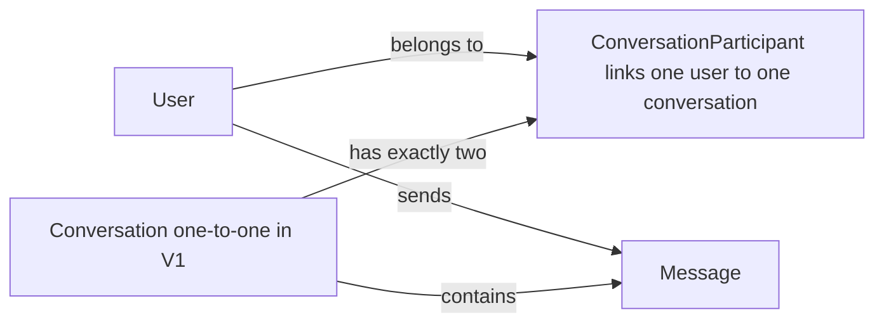
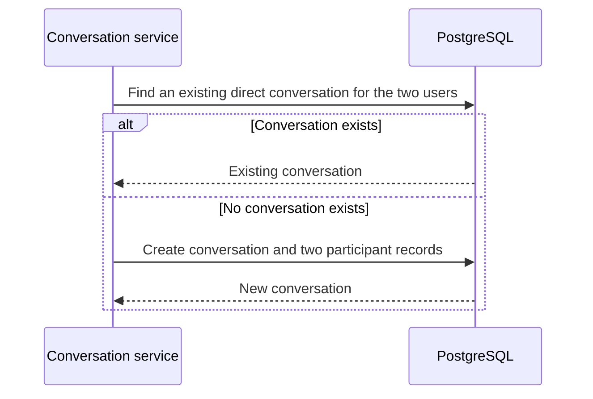

# Database Design

## Purpose

PostgreSQL is Teco's persistent store. Prisma owns the schema definition and migrations in `database/prisma/`; the server uses Prisma Client to access it. The browser client never connects to the database.

## V1 Scope

V1 supports direct, one-to-one conversations only. Each conversation has exactly two `ConversationParticipant` records. Messages belong to one conversation and one sending user.

## Logical Data Model

![Teco V1 entity relationship diagram]//TODO: Create ER Diagram manually



In plain language, the participant table is the join record between users and conversations. It keeps the V1 schema ready for the future possibility of more participants without pretending that V1 already has group chat.

## Tables

### User

| Column | Type | Rules | Purpose |
| --- | --- | --- | --- |
| `id` | UUID | Primary key | Identifies the user. |
| `email` | String | Required, unique | Used for login. |
| `passwordHash` | String | Required | Stores a password hash, never the original password. |
| `createdAt` | DateTime | Required | Creation timestamp. |
| `updatedAt` | DateTime | Required | Last-update timestamp. |

### Conversation

| Column | Type | Rules | Purpose |
| --- | --- | --- | --- |
| `id` | UUID | Primary key | Identifies a direct conversation. |
| `createdAt` | DateTime | Required | Creation timestamp. |
| `updatedAt` | DateTime | Required | Updated when a message changes conversation activity. |

### ConversationParticipant

| Column | Type | Rules | Purpose |
| --- | --- | --- | --- |
| `conversationId` | UUID | Foreign key to `Conversation` | Identifies the conversation. |
| `userId` | UUID | Foreign key to `User` | Identifies a participant. |
| `createdAt` | DateTime | Required | When the participant record was created. |

The combination of `conversationId` and `userId` is unique. This prevents the same user from being attached twice to one conversation.

### Message

| Column | Type | Rules | Purpose |
| --- | --- | --- | --- |
| `id` | UUID | Primary key | Identifies the message. |
| `conversationId` | UUID | Foreign key to `Conversation` | Identifies the message's conversation. |
| `senderId` | UUID | Foreign key to `User` | Identifies the sending user. |
| `content` | String | Required | The message body. |
| `createdAt` | DateTime | Required | Send timestamp. |
| `updatedAt` | DateTime | Required | Last-update timestamp. |

## Relationship Rules



- A user may be in many direct conversations.
- A V1 conversation must have exactly two distinct users.
- The service prevents duplicate direct conversations for the same pair of users.
- A message sender must be a participant in the message's conversation.
- Foreign keys prevent messages and participant records from pointing to missing users or conversations.

## Indexes and Constraints

| Table | Index or constraint | Reason |
| --- | --- | --- |
| `User` | Unique `email` | Prevent duplicate accounts and enable login lookup. |
| `ConversationParticipant` | Unique `(conversationId, userId)` | Prevent duplicate membership. |
| `ConversationParticipant` | Index `userId` | Efficiently list a user's conversations. |
| `Message` | Index `(conversationId, createdAt)` | Efficiently load a conversation's messages in time order. |

## Planned Prisma Schema

This is the intended V1 shape. It is a design reference; the actual `schema.prisma` will be created during the Prisma setup issue.

```prisma
model User {
  id            String                    @id @default(uuid())
  email         String                    @unique
  passwordHash  String
  createdAt     DateTime                  @default(now())
  updatedAt     DateTime                  @updatedAt
  participants  ConversationParticipant[]
  sentMessages  Message[]                 @relation("SentMessages")
}

model Conversation {
  id            String                    @id @default(uuid())
  createdAt     DateTime                  @default(now())
  updatedAt     DateTime                  @updatedAt
  participants  ConversationParticipant[]
  messages      Message[]
}

model ConversationParticipant {
  conversationId String
  userId         String
  createdAt      DateTime     @default(now())
  conversation   Conversation @relation(fields: [conversationId], references: [id], onDelete: Cascade)
  user           User         @relation(fields: [userId], references: [id], onDelete: Cascade)

  @@id([conversationId, userId])
  @@index([userId])
}

model Message {
  id             String       @id @default(uuid())
  conversationId String
  senderId       String
  content        String
  createdAt      DateTime     @default(now())
  updatedAt      DateTime     @updatedAt
  conversation   Conversation @relation(fields: [conversationId], references: [id], onDelete: Cascade)
  sender         User         @relation("SentMessages", fields: [senderId], references: [id])

  @@index([conversationId, createdAt])
}
```

The “exactly two participants” and “no duplicate pair” rules are enforced in the V1 conversation service. They cannot be expressed fully by a simple foreign-key constraint alone.

## Prisma Workflow

```text
Edit schema.prisma
        ↓
prisma migrate dev --name <change-name>
        ↓
Generated migration committed to database/prisma/migrations/
        ↓
prisma generate
        ↓
Server uses the generated Prisma Client
```

Every schema change gets a reviewed migration. Development seed data belongs in `database/prisma/seed.ts` and includes at least two users, one direct conversation, and sample messages.

## V2: Group Chat

Group chat can add a conversation type, group name and avatar, participant roles, and membership-management actions. At that stage the application relaxes V1's exactly-two-participant rule and adds authorization rules for group roles. No V2 fields are added prematurely to V1.
