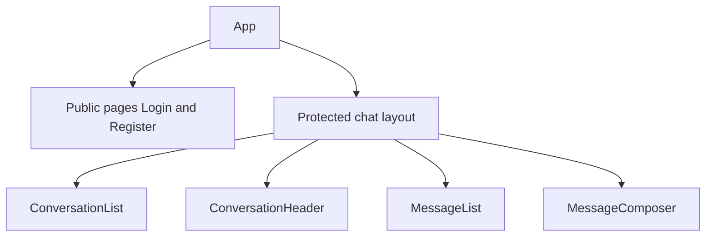
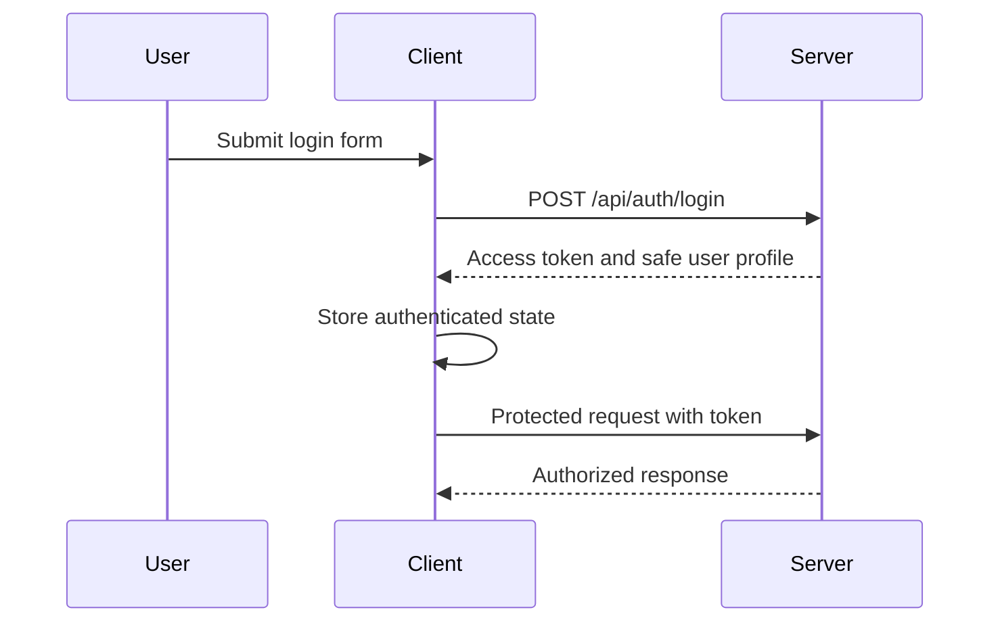

# Frontend Architecture

## Purpose

`client/` contains the React application. It renders the user interface, manages browser-side state, calls the HTTP API, and receives live Socket.IO events. It never connects directly to PostgreSQL and never treats hidden UI as authorization.

## Technology

- React
- Vite
- TypeScript
- Socket.IO client

## Planned Structure

```text
client/
├── src/
│   ├── components/      # Reusable UI pieces
│   ├── pages/           # Route-level screens
│   ├── layouts/         # Shared page layouts
│   ├── services/        # HTTP API client functions
│   ├── socket/          # Socket connection and event handling
│   ├── hooks/           # Reusable React hooks
│   ├── context/         # Small app-wide state boundaries
│   ├── types/           # Client TypeScript types
│   ├── utils/           # Pure helper functions
│   ├── App.tsx
│   └── main.tsx
├── package.json
├── vite.config.ts
└── tsconfig.json
```

Folders are created when needed; V1 should not start with empty files for every possible concern.

## Screens and Routing

| Route | Access | Purpose |
| --- | --- | --- |
| `/register` | Public | Create an account. |
| `/login` | Public | Sign in and receive an access token. |
| `/` | Protected | Show the user's direct-conversation list and selected chat. |
| `/conversations/:conversationId` | Protected | Open a selected direct conversation. |

Protected-route logic redirects an unauthenticated user to `/login`. The server remains the source of truth for whether a token is valid and whether a user may access a conversation.

## UI Composition



V1 components focus on direct conversations. The header displays the other participant; it does not need group metadata or member-management controls.

## State Boundaries

Keep state close to the component that uses it.

| State | Suggested owner | Examples |
| --- | --- | --- |
| Form state | Form component | Email, password, validation messages. |
| Selected conversation | Chat page/layout | Current conversation ID. |
| Conversation and message data | Chat feature hooks | Loading, error, and refreshed data. |
| Authenticated user | Auth context | Current user, token, login, logout. |
| Socket connection | Socket provider or hook | Connection status and event subscriptions. |

Do not add a global state-management library in V1 unless React state and focused hooks stop being sufficient.

## HTTP API Layer

`src/services/` centralizes calls to the server. It:

- uses `VITE_API_URL` as the API base URL;
- attaches the current access token to protected requests;
- returns typed responses; and
- maps failed responses to user-friendly errors.

Feature components call service functions or feature hooks, not `fetch` scattered throughout the UI.

## Authentication Lifecycle



On logout, the client clears its authenticated state, disconnects Socket.IO, and returns to the public route.

## Loading and Error States

Every server-backed view provides a visible loading state, an empty state where applicable, and a recovery path for errors. Examples include an empty conversation list, a conversation with no messages, and a retry action for a failed message load.

## V2 Considerations

Group chat later adds group creation, group identity in the header, member lists, invitations, and member-management controls. These should be built as new UI capabilities rather than complicating direct-message components before they are needed.
