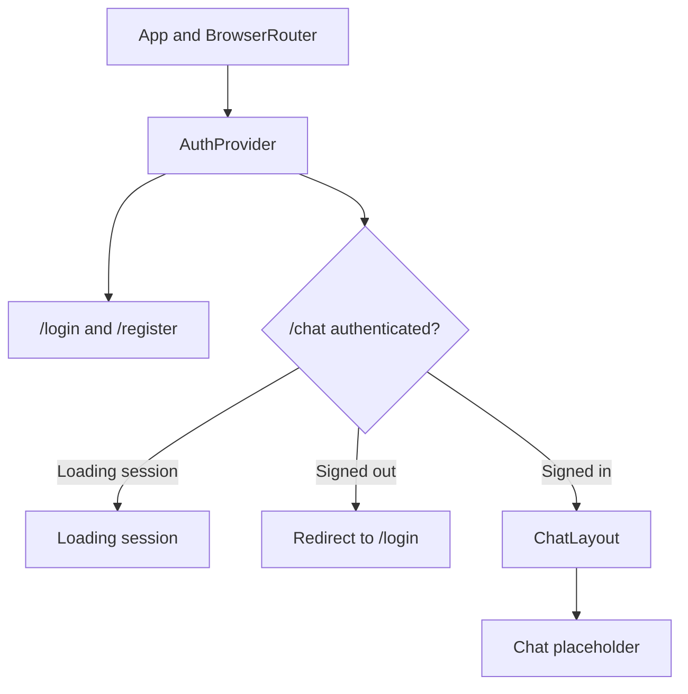

# Frontend Architecture

The `client/` package is a React, TypeScript, and Vite browser application. It implements registration and login screens, a shared auth context, public and protected route guards, and a placeholder chat screen. It does not currently use Socket.IO or implement conversations and messages.

## Current Routes

| Route | Access | Current behavior |
| --- | --- | --- |
| `/` | Public | Redirects to `/login`. |
| `/register` | Public | Displays the account registration form. |
| `/login` | Public | Displays the login form; authenticated users are redirected to `/chat`. |
| `/chat` | Protected | Displays the chat layout and placeholder chat interface. |
| `*` | Public | Displays a not-found message. |

`ProtectedRoute` redirects unauthenticated users to `/login`. The server remains responsible for validating tokens and protecting API data.

## Authentication State

`AuthProvider` exposes the user, token, loading/authenticated state, and `signIn`/`signOut` actions. After a successful login, the form passes the returned user and token to `signIn`. The provider updates React state and persists the token in `localStorage`.

On startup, the provider checks a stored token with `GET /api/user/me`. It restores the user when the request succeeds and clears the local session when verification fails. Logout clears both context state and the persisted token.

## HTTP API Layer

`src/lib/api/apiClient.ts` centralizes browser requests. It uses `VITE_API_URL` when provided and otherwise defaults to `http://localhost:3000`. It attaches the token from `localStorage` to non-auth requests, parses JSON responses, and throws for non-success HTTP responses. `src/services/` contains auth and user request functions.

Vite reads environment overrides from the client package directory, for example `client/.env.local`; the root `.env` is used by Docker Compose and is not automatically loaded by Vite.

## Current UI Composition

```mermaid
flowchart TD
    App["App and BrowserRouter"] --> Auth["AuthProvider"]
    Auth --> Public["/login and /register"]
    Auth --> Guard{"/chat authenticated?"}
    Guard -->|Loading session| Loading["Loading session"]
    Guard -->|Signed out| Login["Redirect to /login"]
    Guard -->|Signed in| Layout["ChatLayout"]
    Layout --> Placeholder["Chat placeholder"]
```

The theme toggle is held in `App`. Chat layout includes a logout action and an empty conversations placeholder. Conversation lists, message lists, and a composer are planned components and do not exist in the current runtime flow.

## Future Client Work

When chat APIs are implemented, feature components should call typed service functions or focused hooks rather than scattering `fetch` calls. Conversation data, selected conversation state, message history, and Socket.IO connection state should remain scoped to the chat feature unless broader sharing becomes necessary.
