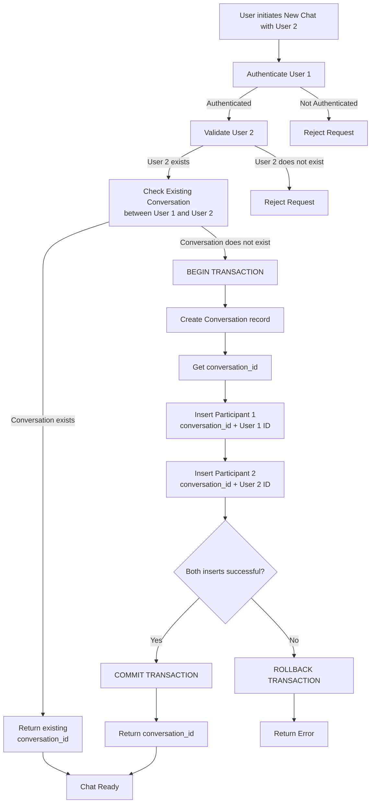

```mermaid
flowchart TD
    A[User initiates New Chat with User 2] --> B[Authenticate User 1]

    B -->|Authenticated| C[Validate User 2]
    B -->|Not Authenticated| X1[Reject Request]

    C -->|User 2 exists| D[Check Existing Conversation<br/>between User 1 and User 2]
    C -->|User 2 does not exist| X2[Reject Request]

    D -->|Conversation exists| E[Return existing<br/>conversation_id]

    D -->|Conversation does not exist| F[BEGIN TRANSACTION]

    F --> G[Create Conversation record]
    G --> H[Get conversation_id]

    H --> I[Insert Participant 1<br/>conversation_id + User 1 ID]
    I --> J[Insert Participant 2<br/>conversation_id + User 2 ID]

    J --> K{Both inserts successful?}

    K -->|Yes| L[COMMIT TRANSACTION]
    K -->|No| M[ROLLBACK TRANSACTION]

    L --> N[Return conversation_id]
    M --> X3[Return Error]

    E --> O[Chat Ready]
    N --> O
```