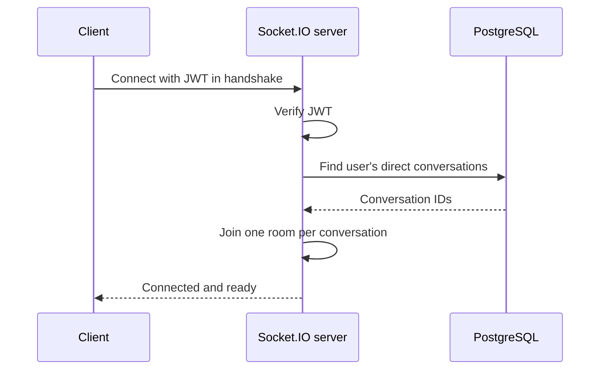
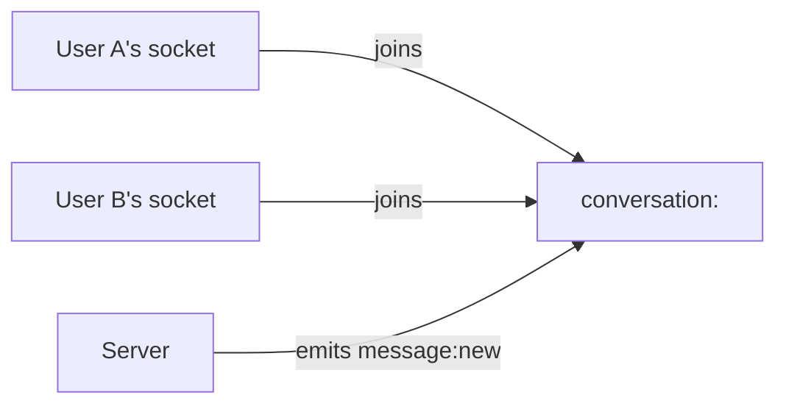
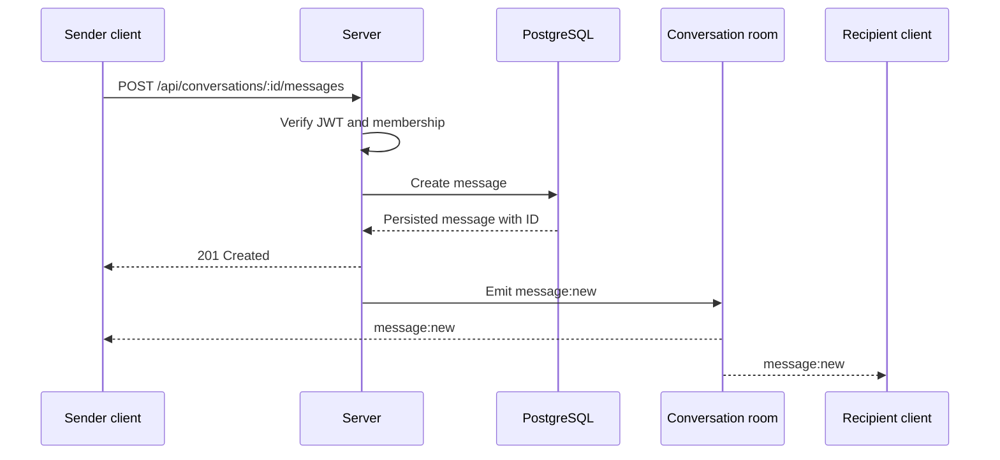

# Real-Time Socket.IO Design

## Purpose

Socket.IO delivers live updates after the server has performed and persisted an operation. It improves responsiveness; it never replaces the HTTP API or database persistence.

## Connection Lifecycle

1. The authenticated client creates one Socket.IO connection after login.
2. The JWT is supplied during the handshake.
3. The server verifies the JWT and associates the socket with its user ID.
4. The server finds the user's direct conversations and joins the socket to one room for each conversation.
5. The client disconnects when it logs out or the application shuts down.

An invalid or absent token prevents the connection from being authorized.

## Room Model

For V1, each room represents one direct conversation and contains sockets from its two participants. The server determines room membership; the client cannot join an arbitrary room merely by knowing its ID.

## Message Delivery

The server emits `message:new` only after the message has been stored successfully. The event contains the stored message, including its ID. The sender client uses that ID to avoid duplicating a message already added from the HTTP response.

## Initial Events

| Event | Direction | When it is used | Payload |
| --- | --- | --- | --- |
| `message:new` | Server → room | A message has been persisted. | The created message. |
| `connect_error` | Server → client | Authentication or connection setup fails. | Safe error description. |

V1 sends messages with HTTP. It does not accept a custom Socket.IO “send message” event, because HTTP gives the sender a clear request/response result and keeps persistence in one path.

## Client Responsibilities

- Open the socket only after authentication succeeds.
- Subscribe to events once and unsubscribe when the corresponding UI is removed.
- Update the relevant conversation by message ID; do not append a duplicate.
- Show a connection problem without losing locally loaded message history.
- Disconnect on logout.

## Server Responsibilities

- Verify the handshake token before associating a socket with a user.
- Determine all room membership from the database.
- Emit events only after authorization and persistence succeed.
- Never trust a client-provided user ID, conversation membership, or room name.
- Log connection failures and unexpected handler errors without exposing sensitive details.

## Reconnection

Socket.IO may reconnect after a temporary network loss. On each successful reconnection, the server repeats authentication and room joining. The client refreshes conversation data through the HTTP API where necessary, rather than assuming it received every event while disconnected.

## V2: Group Chat

The room model remains the same: one room per conversation. V2 group chat changes the membership query from exactly two participants to all authorized members. Member additions and removals must update rooms on active sockets and emit group-specific events only after their database changes succeed.
